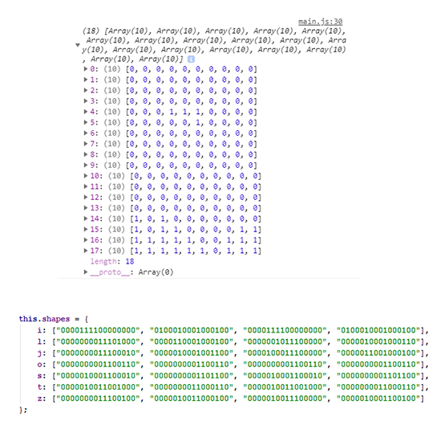

# Tetris

#### You can se DEMO version [Here.](https://zarkozivojnovic.github.io/Tetris/)

---

This is my version of most popular puzzle game called Tetris. You can move and rotate tetrominoes to fill in gaps.
Each full line brings you the points and raise the level.

Control Keys:

* To move left	press ←
* To move right	press →
* To rotate	    press ↑
* To drop faster  press ↓
* To pause the game press "P"

---

Code is divided into two main parts:

- The first part is logic without graphical interface and it is written in ES6 class.
Logic is placed in array of arrays. Every internal array had elements with value of 0 (empty field) or 1 (filled field).
There is a 7 defferent shapes and their position I was presented by four strings, one for each position.

- The second part is rendering on the page and it only prints these arrays in the HTML table tag.

